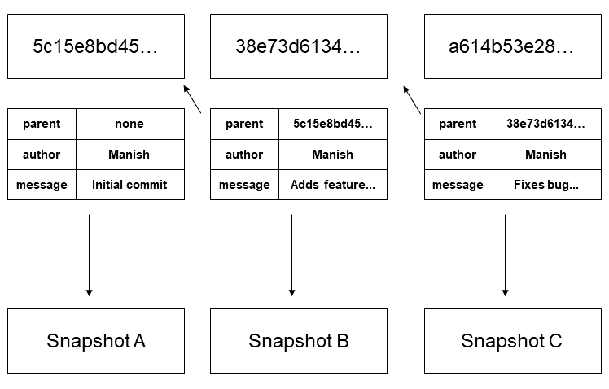

# What are hash values in Git?

Git uses the **SHA-1** hash algorithm to generate a *checksum* number for each change in a document.

{ align=center }

***

##### Sources
- Skoglund, K. (2019). Git Essential Training: The Basics [Video]. LinkedIn Learning. https://www.linkedin.com/learning/git-essential-training-the-basics
- [Pro Git](https://git-scm.com/book/en/v2)